# Git Developer Guide - Complete Visual Reference

A comprehensive guide to Git with real-world scenarios, problem descriptions, and visual diagrams using Mermaid.

## 📋 **Table of Contents**

1. [Git Basics & Concepts](#basics)
2. [Initial Setup & Configuration](#setup)
3. [Daily Workflow Scenarios](#daily-workflow)
4. [Branching Strategies](#branching)
5. [Merging & Resolving Conflicts](#merging)
6. [Rebasing vs Merging](#rebasing)
7. [Undoing Changes](#undoing)
8. [Working with Remote](#remote)
9. [Stashing Changes](#stashing)
10. [Advanced Scenarios](#advanced)
11. [Team Collaboration](#collaboration)
12. [Git History & Logs](#history)
13. [Troubleshooting Common Problems](#troubleshooting)
14. [Best Practices](#best-practices)
15. [Git Hooks & Automation](#hooks)

---

## <a name="basics"></a>📚 **1. Git Basics & Concepts**

### **Understanding Git's Three States**

**Problem:** Developers often get confused about where their changes are and what commands to use.

**Explanation:** Git has three main states for your files:


**Commands:**

```bash
# Check status of files in all three states
git status

# See what's in working directory (unstaged changes)
git diff

# See what's in staging area (staged changes)
git diff --staged

# See commit history (local repository)
git log
```

### **Git Object Model**

**Problem:** Understanding how Git stores data helps you use it more effectively.


---

## <a name="setup"></a>⚙️ **2. Initial Setup & Configuration**

### **First Time Git Setup**

**Scenario:** You just installed Git and need to configure it for the first time.

**Commands:**

```bash
# Set your identity (required)
git config --global user.name "Your Name"
git config --global user.email "your.email@company.com"

# Set default branch name to 'main'
git config --global init.defaultBranch main

# Set default editor
git config --global core.editor "vim"
git config --global core.editor "code --wait"  # For VS Code

# Enable colors
git config --global color.ui auto

# Set line ending preferences
git config --global core.autocrlf input    # For Mac/Linux
git config --global core.autocrlf true     # For Windows

# View all configurations
git config --list

# View specific configuration
git config user.name

# Set configuration for specific repository only (omit --global)
cd /path/to/repo
git config user.email "personal@email.com"
```

### **SSH Key Setup for GitHub/GitLab**

```bash
# Generate SSH key
ssh-keygen -t ed25519 -C "your.email@company.com"

# Start SSH agent
eval "$(ssh-agent -s)"

# Add SSH key to agent
ssh-add ~/.ssh/id_ed25519

# Copy public key to clipboard (Mac)
pbcopy < ~/.ssh/id_ed25519.pub

# Copy public key to clipboard (Linux)
xclip -sel clip < ~/.ssh/id_ed25519.pub

# Test SSH connection
ssh -T git@github.com
```

### **Useful Aliases**

```bash
# Setup common aliases
git config --global alias.st status
git config --global alias.co checkout
git config --global alias.br branch
git config --global alias.ci commit
git config --global alias.unstage 'reset HEAD --'
git config --global alias.last 'log -1 HEAD'
git config --global alias.visual 'log --oneline --graph --decorate --all'
git config --global alias.amend 'commit --amend --no-edit'

# Now you can use: git st, git co, git br, etc.
```

---

## <a name="daily-workflow"></a>💼 **3. Daily Workflow Scenarios**

### **Scenario 1: Starting Fresh - Cloning a Repository**

**Problem:** You need to start working on an existing project.


**Commands:**

```bash
# Clone via HTTPS
git clone https://github.com/username/repository.git

# Clone via SSH (recommended)
git clone git@github.com:username/repository.git

# Clone into specific directory
git clone git@github.com:username/repository.git my-project

# Clone specific branch
git clone -b develop git@github.com:username/repository.git

# Shallow clone (faster, only recent history)
git clone --depth 1 git@github.com:username/repository.git
```

### **Scenario 2: Daily Development Workflow**

**Problem:** You need to make changes, commit them, and push to remote.


**Commands:**

```bash
# Step 1: Pull latest changes
git pull origin main

# Step 2: Check current status
git status

# Step 3: Stage changes (multiple options)
git add file.txt                    # Add specific file
git add src/                        # Add entire directory
git add .                           # Add all changes
git add -A                          # Add all changes (including deletions)
git add -p                          # Interactive staging (patch mode)

# Step 4: Commit changes
git commit -m "feat: add user authentication"

# Better commit with description
git commit -m "feat: add user authentication" -m "Implemented JWT-based authentication with refresh tokens"

# Step 5: Push to remote
git push origin main

# First time pushing a new branch
git push -u origin feature-branch
# After setting upstream, just use:
git push
```

### **Scenario 3: Working on Multiple Files**

**Problem:** You modified several files but want to commit them separately with different messages.

```bash
# Check what changed
git status

# Stage and commit specific files
git add src/auth/login.java
git commit -m "feat: implement login functionality"

git add src/auth/register.java
git commit -m "feat: implement user registration"

git add tests/auth/login.test.java
git commit -m "test: add login tests"

# Or use interactive add
git add -p
# This will show each change and ask: Stage this hunk [y,n,q,a,d,e,?]?
# y - stage this hunk
# n - do not stage this hunk
# q - quit
# a - stage this and all remaining hunks
# d - do not stage this or any remaining hunks
# e - manually edit the hunk
```

### **Scenario 4: Checking What You Changed**

**Problem:** You want to see what you modified before committing.

```bash
# View unstaged changes (working directory vs staging)
git diff

# View staged changes (staging vs last commit)
git diff --staged
git diff --cached  # same as --staged

# View changes in specific file
git diff README.md

# View changes between branches
git diff main..feature-branch

# View changes between commits
git diff abc123..def456

# View summary of changes (files changed, insertions, deletions)
git diff --stat

# View word-level differences (better for prose)
git diff --word-diff

# Compare with remote branch
git diff origin/main
```

---

## <a name="branching"></a>🌿 **4. Branching Strategies**

### **Understanding Branches**

**Problem:** You need to work on features without affecting the main codebase.


### **Branch Operations**

**Scenario 1: Creating and Switching Branches**

```bash
# Create new branch
git branch feature-user-profile

# Switch to branch
git checkout feature-user-profile

# Create and switch in one command (recommended)
git checkout -b feature-user-profile

# Modern way (Git 2.23+)
git switch -c feature-user-profile

# List all branches
git branch

# List all branches including remote
git branch -a

# List branches with last commit
git branch -v

# List merged branches
git branch --merged

# List unmerged branches
git branch --no-merged
```

### **Scenario 2: Common Branching Strategy (Git Flow)**

**Problem:** Your team needs a structured workflow for development, staging, and production.


**Commands for Git Flow:**

```bash
# Main branches
main (production)
develop (integration)

# Create feature branch from develop
git checkout develop
git checkout -b feature/user-authentication

# Work on feature...
git add .
git commit -m "feat: implement authentication"

# Merge feature back to develop
git checkout develop
git merge feature/user-authentication

# Delete feature branch after merge
git branch -d feature/user-authentication

# Create release branch
git checkout develop
git checkout -b release/1.0.0

# Prepare release (version bumps, documentation)
git commit -am "chore: prepare release 1.0.0"

# Merge to main and tag
git checkout main
git merge release/1.0.0
git tag -a v1.0.0 -m "Release version 1.0.0"

# Merge back to develop
git checkout develop
git merge release/1.0.0

# Delete release branch
git branch -d release/1.0.0

# Hotfix workflow
git checkout main
git checkout -b hotfix/1.0.1
# Fix the bug...
git commit -am "fix: critical security issue"

# Merge to main
git checkout main
git merge hotfix/1.0.1
git tag -a v1.0.1 -m "Hotfix 1.0.1"

# Merge to develop
git checkout develop
git merge hotfix/1.0.1

# Delete hotfix branch
git branch -d hotfix/1.0.1
```

### **Scenario 3: GitHub Flow (Simpler Alternative)**

**Problem:** Git Flow is too complex for your team's needs.


**Commands:**

```bash
# 1. Create branch from main
git checkout main
git pull origin main
git checkout -b feature/add-payment

# 2. Work and commit regularly
git add .
git commit -m "feat: add payment gateway integration"

# 3. Push branch to remote
git push -u origin feature/add-payment

# 4. Create Pull Request on GitHub/GitLab

# 5. After PR approval, merge on GitHub/GitLab

# 6. Pull main and delete local branch
git checkout main
git pull origin main
git branch -d feature/add-payment

# 7. Delete remote branch (if not auto-deleted)
git push origin --delete feature/add-payment
```

---

## <a name="merging"></a>🔀 **5. Merging & Resolving Conflicts**

### **Understanding Merge Strategies**

**Problem:** You need to combine work from different branches.


### **Scenario 1: Fast-Forward Merge**

**Problem:** Feature branch is ahead of main, and main hasn't changed.


**Commands:**

```bash
# This creates a linear history
git checkout main
git merge feature

# Force fast-forward (fail if not possible)
git merge --ff-only feature

# Prevent fast-forward (always create merge commit)
git merge --no-ff feature
```

### **Scenario 2: Three-Way Merge**

**Problem:** Both branches have diverged and have different commits.


**Commands:**

```bash
# Merge feature into current branch
git checkout main
git merge feature

# If no conflicts, it will create a merge commit automatically
# If there are conflicts, Git will pause and ask you to resolve them
```

### **Scenario 3: Merge Conflict Resolution**

**Problem:** Both branches modified the same lines in the same file.

```mermaid
sequenceDiagram
    participant Dev as Developer
    participant Git as Git
    
    Dev->>Git: git merge feature
    Git->>Dev: CONFLICT! Auto-merge failed
    Note over Dev: Edit conflicted files
    Dev->>Git: git add resolved-file.txt
    Dev->>Git: git commit
    Git->>Dev: Merge complete ✓
```



**Visual Example of Conflict Markers:**

```java
public class UserService {
    public String getWelcomeMessage() {
<<<<<<< HEAD (Current Change - main branch)
        return "Welcome to our application!";
=======
        return "Hello and welcome!";
>>>>>>> feature-greeting (Incoming Change - feature branch)
    }
}
```

**Commands:**

```bash
# Attempt merge
git checkout main
git merge feature-branch

# Git will show: CONFLICT (content): Merge conflict in file.txt
# Automatic merge failed; fix conflicts and then commit the result.

# Check which files have conflicts
git status

# View conflicts in a file
cat file.txt

# Option 1: Manually resolve conflicts
# Edit the file, remove conflict markers (<<<<<<, =======, >>>>>>>)
# Keep the code you want

# Option 2: Use merge tool
git mergetool

# Option 3: Choose one side entirely
git checkout --ours file.txt     # Keep main branch version
git checkout --theirs file.txt   # Keep feature branch version

# After resolving, stage the file
git add file.txt

# Continue with merge commit
git commit

# If you want to abort the merge
git merge --abort

# View merge conflicts in a visual way
git diff --name-only --diff-filter=U  # List conflicted files
```

### **Scenario 4: Resolving Multiple Files**

```bash
# See all conflicted files
git status | grep "both modified"

# Resolve conflicts one by one
for file in $(git diff --name-only --diff-filter=U); do
    echo "Resolving: $file"
    code $file  # Open in editor
    read -p "Press enter when resolved..."
    git add $file
done

# Commit the merge
git commit -m "Merge feature-branch into main"
```

---

## <a name="rebasing"></a>🔄 **6. Rebasing vs Merging**

### **Understanding Rebase**

**Problem:** You want a cleaner, linear history without merge commits.

**Before Rebase:**


**After Rebase:**


### **Rebase vs Merge - When to Use What**

| Scenario | Use Rebase | Use Merge |
|----------|-----------|-----------|
| Updating feature branch with main | ✅ Yes | ❌ No |
| Integrating feature into main | ❌ No | ✅ Yes |
| Public/shared branches | ❌ Never | ✅ Always |
| Your private branches | ✅ Yes | Can use |
| Want clean history | ✅ Yes | ❌ No |
| Want to preserve history | ❌ No | ✅ Yes |

### **Scenario 1: Rebasing Feature Branch**

**Problem:** Your feature branch is behind main and you want to update it cleanly.

```bash
# Start on your feature branch
git checkout feature-branch

# Fetch latest from remote
git fetch origin

# Rebase onto main
git rebase origin/main

# If conflicts occur, resolve them
# Edit the conflicted files
git add resolved-file.txt

# Continue rebase
git rebase --continue

# If you want to abort
git rebase --abort

# Force push to remote (required after rebase)
# ⚠️ Only do this on your own branches!
git push --force-with-lease origin feature-branch
```

### **Scenario 2: Interactive Rebase (Cleaning Up History)**

**Problem:** You have messy commits and want to clean them up before merging.


**After Interactive Rebase:**


**Commands:**

```bash
# Rebase last 4 commits interactively
git rebase -i HEAD~4

# This opens an editor with:
# pick abc123 WIP
# pick def456 fix typo  
# pick ghi789 oops forgot file
# pick jkl012 actual feature

# Change to:
# pick abc123 WIP
# squash def456 fix typo
# squash ghi789 oops forgot file  
# reword jkl012 actual feature

# Available commands:
# p, pick = use commit
# r, reword = use commit, but edit the commit message
# e, edit = use commit, but stop for amending
# s, squash = use commit, but meld into previous commit
# f, fixup = like squash, but discard this commit's log message
# d, drop = remove commit

# Save and close editor, then follow prompts
```

### **Scenario 3: Pulling with Rebase**

**Problem:** You want to avoid merge commits when pulling changes.

```bash
# Instead of:
git pull origin main

# Use:
git pull --rebase origin main

# Set rebase as default for pull
git config --global pull.rebase true

# Now git pull will rebase by default
```

### **Golden Rule of Rebasing**

```mermaid
graph TD
    A[Is the branch shared?] -->|Yes| B[❌ DO NOT REBASE]
    A -->|No| C[Is it only your work?]
    C -->|Yes| D[✅ SAFE TO REBASE]
    C -->|No| B
    
    style B fill:#f99,stroke:#333,stroke-width:2px
    style D fill:#9f9,stroke:#333,stroke-width:2px
```



**Never rebase commits that exist outside your repository and that people may have based work on!**

---

## <a name="undoing"></a>⏮️ **7. Undoing Changes**

### **The Undo Decision Tree**


### **Scenario 1: Undo Unstaged Changes**

**Problem:** You modified a file but haven't staged it yet, and you want to discard those changes.

```bash
# Discard changes in specific file (restore from last commit)
git checkout -- filename.txt

# Modern way (Git 2.23+)
git restore filename.txt

# Discard all unstaged changes
git checkout -- .
git restore .

# Discard changes in directory
git checkout -- src/
git restore src/

# See what would be removed (dry run)
git clean -n

# Remove untracked files
git clean -f

# Remove untracked files and directories
git clean -fd
```

### **Scenario 2: Unstage Files**

**Problem:** You staged files but want to unstage them (keep changes in working directory).

```bash
# Unstage specific file
git reset HEAD filename.txt

# Modern way
git restore --staged filename.txt

# Unstage all files
git reset HEAD
git restore --staged .
```

### **Scenario 3: Amend Last Commit**

**Problem:** You just committed but forgot to add a file or want to change the commit message.

```bash
# Change commit message
git commit --amend

# Add forgotten file to last commit
git add forgotten-file.txt
git commit --amend --no-edit

# Amend and change message
git add forgotten-file.txt
git commit --amend -m "Updated commit message"

# If already pushed, you need to force push (⚠️ be careful!)
git push --force-with-lease
```

### **Scenario 4: Undo Last Commit (Keep Changes)**

**Problem:** You committed too early and want to uncommit but keep your changes.

```bash
# Undo last commit, keep changes staged
git reset --soft HEAD~1

# Undo last commit, keep changes unstaged
git reset HEAD~1
git reset --mixed HEAD~1  # same as above

# Undo last 3 commits
git reset --soft HEAD~3
```

### **Scenario 5: Undo Last Commit (Discard Changes)**

**Problem:** You committed something wrong and want to completely remove it.

```bash
# ⚠️ WARNING: This deletes your work!
git reset --hard HEAD~1

# Undo last 3 commits
git reset --hard HEAD~3

# Reset to specific commit
git reset --hard abc123

# If you did this by mistake, you can recover (if recent)
git reflog
git reset --hard HEAD@{1}
```

### **Scenario 6: Undo Pushed Commit (Safe Way)**

**Problem:** You pushed a bad commit to a shared branch and need to undo it safely.

```bash
# Create new commit that undoes the changes
git revert abc123

# Revert multiple commits
git revert abc123..def456

# Revert merge commit
git revert -m 1 merge-commit-hash

# Push the revert
git push origin main
```

**Visual Representation:**


### **Scenario 7: Remove File from Git but Keep Locally**

**Problem:** You committed a file that should have been in .gitignore.

```bash
# Remove from Git but keep in working directory
git rm --cached filename.txt

# Remove directory
git rm --cached -r directory/

# Common use case: remove node_modules after adding to .gitignore
echo "node_modules/" >> .gitignore
git rm --cached -r node_modules/
git commit -m "chore: remove node_modules from git"
```

### **Scenario 8: Recover Deleted Commit**

**Problem:** You accidentally deleted commits and need to recover them.

```bash
# View reflog (shows all operations)
git reflog

# Output shows:
# abc123 HEAD@{0}: reset: moving to HEAD~1
# def456 HEAD@{1}: commit: my deleted commit
# ...

# Recover by resetting to that commit
git reset --hard HEAD@{1}

# Or create new branch from that point
git branch recovered-branch HEAD@{1}
```

---

## <a name="remote"></a>🌐 **8. Working with Remote**

### **Understanding Remote Branches**


### **Scenario 1: Working with Multiple Remotes**

**Problem:** You need to work with both the original repository and your fork.

```bash
# List remotes
git remote -v

# Add remote
git remote add upstream https://github.com/original/repo.git

# Fetch from upstream
git fetch upstream

# Merge upstream changes into your branch
git checkout main
git merge upstream/main

# Push to your fork
git push origin main

# Change remote URL
git remote set-url origin git@github.com:newuser/repo.git

# Remove remote
git remote remove upstream
```

### **Scenario 2: Tracking Remote Branches**

**Problem:** You want to work on a remote branch that doesn't exist locally.

```bash
# List all remote branches
git branch -r

# Create local branch tracking remote
git checkout -b feature-branch origin/feature-branch

# Modern way (auto-tracks)
git switch feature-branch

# Set upstream for existing branch
git branch --set-upstream-to=origin/feature-branch

# Push and set upstream in one command
git push -u origin feature-branch

# See tracking information
git branch -vv
```

### **Scenario 3: Syncing Fork with Original Repository**

**Problem:** Your fork is behind the original repository and needs to be updated.


**Commands:**

```bash
# One-time setup
git remote add upstream https://github.com/original-owner/repo.git

# Regular sync workflow
git fetch upstream
git checkout main
git merge upstream/main
git push origin main

# Alternative: rebase instead of merge
git fetch upstream
git checkout main
git rebase upstream/main
git push --force-with-lease origin main
```

### **Scenario 4: Fetch vs Pull**

**Problem:** Understanding the difference between fetch and pull.

```mermaid
graph LR
    A[git fetch] -->|Downloads changes| B[Remote tracking branches]
    B -->|Inspect changes| C[Local branches]
    
    D[git pull] -->|Downloads + Merges| C
    
    style A fill:#bbf,stroke:#333,stroke-width:2px
    style D fill:#f9f,stroke:#333,stroke-width:2px
```

**Commands:**

```bash
# Fetch only (safe, doesn't change your work)
git fetch origin

# See what changed
git log origin/main

# See differences
git diff main origin/main

# Then merge when ready
git merge origin/main

# Pull = Fetch + Merge
git pull origin main

# Pull with rebase
git pull --rebase origin main
```

### **Scenario 5: Cleaning Up Remote Branches**

**Problem:** Many feature branches on remote that have been merged and are no longer needed.

```bash
# Delete remote branch
git push origin --delete feature-branch

# Delete multiple remote branches
git branch -r | grep "origin/feature-" | sed 's/origin\///' | xargs -I {} git push origin --delete {}

# Prune deleted remote branches from local
git fetch --prune
git fetch -p  # short form

# Clean up local branches that track deleted remotes
git branch -vv | grep ': gone]' | awk '{print $1}' | xargs git branch -D

# See what would be pruned (dry run)
git remote prune origin --dry-run
```

---

## <a name="stashing"></a>💼 **9. Stashing Changes**

### **Understanding Stash**

**Problem:** You need to switch branches but have uncommitted changes you want to keep.

```mermaid
graph LR
    A[Working Directory<br/>with changes] -->|git stash| B[Stash Storage]
    B -->|git stash pop| A
    B -->|git stash apply| A
    
    style A fill:#f9f,stroke:#333,stroke-width:2px
    style B fill:#bbf,stroke:#333,stroke-width:2px
```

### **Scenario 1: Basic Stashing**

```bash
# Stash current changes
git stash

# Stash with message
git stash save "WIP: working on login feature"

# Modern way with message
git stash push -m "WIP: working on login feature"

# List all stashes
git stash list

# Output:
# stash@{0}: On main: WIP: working on login feature
# stash@{1}: On develop: emergency fix
# stash@{2}: On feature: half-done work

# Apply most recent stash and remove it
git stash pop

# Apply most recent stash but keep it
git stash apply

# Apply specific stash
git stash apply stash@{1}

# Remove specific stash
git stash drop stash@{1}

# Remove all stashes
git stash clear
```

### **Scenario 2: Stashing Untracked Files**

**Problem:** You created new files that you want to stash too.

```bash
# Stash including untracked files
git stash -u
git stash --include-untracked

# Stash everything including ignored files
git stash -a
git stash --all
```

### **Scenario 3: Partial Stashing**

**Problem:** You want to stash only some files, not all changes.

```bash
# Interactive stash (choose what to stash)
git stash -p
git stash --patch

# Stash specific files
git stash push -m "stash specific files" file1.txt file2.txt

# Stash everything except specific files
git stash push -- '*.txt'  # stash all .txt files
```

### **Scenario 4: Creating Branch from Stash**

**Problem:** You stashed work and want to create a new branch for it.

```bash
# Create branch from stash and apply stash
git stash branch feature-from-stash stash@{0}

# This does:
# 1. Creates new branch
# 2. Checks out that branch
# 3. Applies the stash
# 4. Drops the stash
```

### **Scenario 5: Viewing Stash Contents**

```bash
# Show summary of stash
git stash show

# Show full diff
git stash show -p

# Show specific stash
git stash show -p stash@{1}

# List files in stash
git stash show --name-only
```

---

## <a name="advanced"></a>🚀 **10. Advanced Scenarios**

### **Scenario 1: Cherry-Pick (Apply Specific Commit)**

**Problem:** You want to apply a specific commit from another branch.

```mermaid
gitGraph
    commit id: "A"
    commit id: "B"
    branch feature
    checkout feature
    commit id: "C"
    commit id: "D (needed)"
    commit id: "E"
    checkout main
    cherry-pick id:"D"
```

**Commands:**

```bash
# Cherry-pick single commit
git cherry-pick abc123

# Cherry-pick multiple commits
git cherry-pick abc123 def456 ghi789

# Cherry-pick range of commits
git cherry-pick abc123..def456

# Cherry-pick without committing (stage changes only)
git cherry-pick --no-commit abc123

# If conflicts, resolve and continue
git add resolved-file.txt
git cherry-pick --continue

# Abort cherry-pick
git cherry-pick --abort
```

### **Scenario 2: Bisect (Find Bug Introduction)**

**Problem:** A bug exists but you don't know which commit introduced it.

```mermaid
graph LR
    A[Start] -->|git bisect start| B[Mark bad commit]
    B -->|git bisect bad| C[Mark good commit]
    C -->|git bisect good| D[Git checks out middle]
    D -->|Test| E{Bug exists?}
    E -->|Yes| F[git bisect bad]
    E -->|No| G[git bisect good]
    F --> D
    G --> D
    D -->|Found| H[Guilty commit!]
    
    style H fill:#f99,stroke:#333,stroke-width:2px
```

**Commands:**

```bash
# Start bisect
git bisect start

# Mark current commit as bad (has bug)
git bisect bad

# Mark known good commit (doesn't have bug)
git bisect good abc123

# Git checks out a commit in the middle
# Test if bug exists...

# If bug exists:
git bisect bad

# If bug doesn't exist:
git bisect good

# Git will keep narrowing down until it finds the first bad commit
# When found, it will show:
# abc123 is the first bad commit

# End bisect and return to original branch
git bisect reset

# Automate with script
git bisect start HEAD abc123
git bisect run ./test-script.sh
# test-script.sh should exit 0 if good, non-zero if bad
```

### **Scenario 3: Subtree (Managing Dependencies)**

**Problem:** You want to include another repository as a subdirectory.

```bash
# Add subtree
git subtree add --prefix=lib/mylib https://github.com/user/mylib.git main --squash

# Pull updates from subtree
git subtree pull --prefix=lib/mylib https://github.com/user/mylib.git main --squash

# Push changes back to subtree repository
git subtree push --prefix=lib/mylib https://github.com/user/mylib.git main

# Split subtree into its own branch
git subtree split --prefix=lib/mylib -b mylib-branch
```

### **Scenario 4: Worktree (Multiple Working Directories)**

**Problem:** You need to work on multiple branches simultaneously without stashing/committing.

```bash
# List worktrees
git worktree list

# Create new worktree
git worktree add ../project-feature feature-branch

# Create new worktree with new branch
git worktree add -b new-feature ../project-new-feature

# Now you have two directories:
# ./project (main branch)
# ../project-feature (feature-branch)

# Remove worktree
git worktree remove ../project-feature

# Prune deleted worktrees
git worktree prune
```

### **Scenario 5: Blame (Find Who Changed Lines)**

**Problem:** You need to know who changed specific lines and when.

```bash
# Show who last modified each line
git blame filename.txt

# Blame specific lines
git blame -L 10,20 filename.txt

# Show commit details for each line
git blame -l filename.txt

# Ignore whitespace changes
git blame -w filename.txt

# See changes before specific commit
git blame abc123^ -- filename.txt

# More readable format
git blame -c filename.txt

# Show email instead of name
git blame -e filename.txt
```

### **Scenario 6: Filter-Branch (Rewrite History)**

**Problem:** You need to remove sensitive data from entire Git history.

```bash
# ⚠️ WARNING: This rewrites history! Use with extreme caution!

# Remove file from all history
git filter-branch --tree-filter 'rm -f passwords.txt' HEAD

# Remove file from all commits (faster)
git filter-branch --index-filter 'git rm --cached --ignore-unmatch passwords.txt' HEAD

# Change author for all commits
git filter-branch --commit-filter '
    if [ "$GIT_AUTHOR_EMAIL" = "old@email.com" ];
    then
        GIT_AUTHOR_NAME="New Name";
        GIT_AUTHOR_EMAIL="new@email.com";
        git commit-tree "$@";
    else
        git commit-tree "$@";
    fi' HEAD

# Modern alternative: git-filter-repo (recommended)
pip install git-filter-repo
git filter-repo --path passwords.txt --invert-paths
```

---

## <a name="collaboration"></a>👥 **11. Team Collaboration**

### **Scenario 1: Pull Request Workflow**

**Problem:** You need to contribute to a project with code review.

```mermaid
sequenceDiagram
    participant Dev as Developer
    participant Fork as Forked Repo
    participant PR as Pull Request
    participant Original as Original Repo
    
    Dev->>Fork: 1. Fork repository
    Dev->>Dev: 2. Clone fork
    Dev->>Dev: 3. Create feature branch
    Dev->>Dev: 4. Make changes & commit
    Dev->>Fork: 5. Push to fork
    Fork->>PR: 6. Create Pull Request
    PR->>PR: 7. Code Review
    PR->>PR: 8. Address feedback
    PR->>Original: 9. Merge PR
```

**Commands:**

```bash
# 1. Fork on GitHub/GitLab (use web interface)

# 2. Clone your fork
git clone git@github.com:your-username/repository.git
cd repository

# 3. Add upstream remote
git remote add upstream git@github.com:original-owner/repository.git

# 4. Create feature branch
git checkout -b feature/add-new-feature

# 5. Make changes and commit
git add .
git commit -m "feat: add new feature"

# 6. Push to your fork
git push -u origin feature/add-new-feature

# 7. Create PR on GitHub/GitLab

# 8. Address review feedback
# Make changes...
git add .
git commit -m "fix: address review comments"
git push

# 9. If upstream changes happen, sync your branch
git fetch upstream
git rebase upstream/main
git push --force-with-lease

# 10. After PR is merged, sync your fork
git checkout main
git fetch upstream
git merge upstream/main
git push origin main

# Clean up
git branch -d feature/add-new-feature
git push origin --delete feature/add-new-feature
```

### **Scenario 2: Code Review Process**

**Problem:** You're reviewing someone's PR and want to test it locally.

```bash
# Fetch PR (GitHub)
git fetch origin pull/123/head:pr-123
git checkout pr-123

# Or add PR refs to git config
git config --add remote.origin.fetch '+refs/pull/*/head:refs/remotes/origin/pr/*'
git fetch origin
git checkout pr-123

# For GitLab
git fetch origin merge-requests/123/head:mr-123
git checkout mr-123

# Test the changes
./run-tests.sh

# Leave comments on GitHub/GitLab

# If suggesting changes, can create commits
git checkout -b pr-123-suggestions
# Make changes...
git push origin pr-123-suggestions
```

### **Scenario 3: Handling Large Team Conflicts**

**Problem:** Multiple people working on the same files causing frequent conflicts.

```bash
# Strategy 1: Communicate frequently
# - Daily standup mentions what files you're working on
# - Use feature flags to work in parallel

# Strategy 2: Keep branches short-lived
# - Merge features quickly
# - Break large features into smaller PRs

# Strategy 3: Rebase frequently
git fetch origin
git rebase origin/main

# Strategy 4: Use rerere (reuse recorded resolution)
git config --global rerere.enabled true
# Git will remember how you resolved conflicts before

# When conflict happens for 2nd time:
git rerere
# Git will apply previous resolution automatically
```

### **Scenario 4: Conventional Commits**

**Problem:** Team needs consistent commit message format.

```bash
# Format: <type>(<scope>): <subject>

# Types:
# feat: New feature
# fix: Bug fix
# docs: Documentation only
# style: Code style (formatting, semicolons, etc.)
# refactor: Code change that neither fixes a bug nor adds a feature
# perf: Performance improvement
# test: Adding tests
# chore: Maintenance tasks

# Examples:
git commit -m "feat(auth): add JWT authentication"
git commit -m "fix(api): handle null response from user service"
git commit -m "docs(readme): add installation instructions"
git commit -m "refactor(database): optimize query performance"
git commit -m "test(auth): add login integration tests"
git commit -m "chore(deps): upgrade spring boot to 3.0"

# Breaking changes
git commit -m "feat(api)!: change response format

BREAKING CHANGE: API now returns data in snake_case instead of camelCase"
```

---

## <a name="history"></a>📜 **12. Git History & Logs**

### **Scenario 1: Viewing Commit History**

```bash
# Basic log
git log

# One line per commit
git log --oneline

# Graph view (best for branches)
git log --oneline --graph --decorate --all

# Last N commits
git log -n 5
git log -5  # same

# Show commits by author
git log --author="John Doe"

# Show commits by date
git log --since="2025-11-01"
git log --after="2025-11-01"
git log --until="2025-11-18"
git log --before="2025-11-18"

# Combine date ranges
git log --since="2 weeks ago" --until="yesterday"

# Show commits affecting specific file
git log -- path/to/file.txt

# Show commits with specific message
git log --grep="bug fix"

# Show commits with changed lines
git log -p

# Show commits with stats
git log --stat

# Show only merge commits
git log --merges

# Show only non-merge commits
git log --no-merges
```

### **Scenario 2: Beautiful Git Log**

```bash
# Pretty format
git log --pretty=format:"%h - %an, %ar : %s"

# Custom format with colors
git log --pretty=format:"%C(yellow)%h%C(reset) - %C(blue)%an%C(reset), %C(green)%ar%C(reset) : %s"

# Graph with custom format
git log --graph --pretty=format:'%C(yellow)%h%C(reset) -%C(auto)%d%C(reset) %s %C(green)(%cr) %C(bold blue)<%an>%C(reset)' --abbrev-commit --all

# Create alias for beautiful log
git config --global alias.lg "log --graph --pretty=format:'%C(yellow)%h%C(reset) -%C(auto)%d%C(reset) %s %C(green)(%cr) %C(bold blue)<%an>%C(reset)' --abbrev-commit --all"

# Now use: git lg
```

### **Scenario 3: Searching Through History**

**Problem:** You need to find when a specific change was made.

```bash
# Search for commit that added/removed a string
git log -S "function_name"

# Search for commits with regex
git log -G "regex_pattern"

# Find commits that changed specific line(s)
git log -L 10,20:filename.txt

# Find when file was deleted
git log --full-history --all -- path/to/deleted/file.txt

# Show commits that touched files in directory
git log -- src/components/

# Find merge commit that brought in a commit
git log --ancestry-path abc123..main --merges
```

### **Scenario 4: Comparing Changes**

```bash
# Compare two branches
git diff main..feature-branch

# See commits in feature-branch not in main
git log main..feature-branch

# See commits in main not in feature-branch
git log feature-branch..main

# See all commits that differ
git log --left-right main...feature-branch

# Compare files between branches
git diff main:file.txt feature:file.txt

# Show what changed in last commit
git show HEAD

# Show specific commit
git show abc123

# Show changes in commit for specific file
git show abc123:path/to/file.txt
```

### **Scenario 5: Reflog (Safety Net)**

**Problem:** You need to recover from a mistake.

```bash
# View reflog (shows all HEAD movements)
git reflog

# Output shows:
# abc123 HEAD@{0}: commit: latest commit
# def456 HEAD@{1}: reset: moving to HEAD~1
# ghi789 HEAD@{2}: commit: deleted commit
# ...

# Go back to previous state
git reset --hard HEAD@{2}

# View reflog for specific branch
git reflog show feature-branch

# Reflog with dates
git reflog --date=iso
```

---

## <a name="troubleshooting"></a>🔧 **13. Troubleshooting Common Problems**

### **Problem 1: "Detached HEAD" State**

**Scenario:** You checked out a commit and now Git says you're in "detached HEAD" state.

```mermaid
graph LR
    A[Commit 1] --> B[Commit 2]
    B --> C[Commit 3]
    C --> D[Commit 4<br/>main]
    B -.->|HEAD| B
    
    style B fill:#f99,stroke:#333,stroke-width:3px
    style D fill:#9f9,stroke:#333,stroke-width:2px
```

**Solution:**

```bash
# If you made changes and want to keep them
git branch temp-branch
git checkout main
git merge temp-branch

# If you want to discard changes
git checkout main

# If you want to move current branch here
git branch -f main HEAD
git checkout main
```

### **Problem 2: Accidentally Committed to Wrong Branch**

**Scenario:** You meant to create a feature branch but committed to main.

```bash
# Don't push yet!

# Option 1: Move commits to new branch
git branch feature-branch      # Create branch at current position
git reset --hard HEAD~3        # Move main back 3 commits
git checkout feature-branch    # Switch to new branch with commits

# Option 2: Cherry-pick to correct branch
git checkout -b feature-branch main~3  # Create branch at point before commits
git cherry-pick abc123 def456 ghi789   # Cherry-pick the commits
git checkout main
git reset --hard HEAD~3                # Remove from main
```

### **Problem 3: Merge Conflict Hell**

**Scenario:** Complex merge with many conflicts.

```bash
# Option 1: Abort and retry with strategy
git merge --abort
git merge -X theirs feature-branch    # Prefer their changes
git merge -X ours feature-branch      # Prefer our changes

# Option 2: Use merge tool
git mergetool

# Option 3: Checkout entire file from one side
git checkout --ours path/to/file.txt
git checkout --theirs path/to/file.txt

# Option 4: Merge one file at a time
for file in $(git diff --name-only --diff-filter=U); do
    echo "Merging: $file"
    code $file
    read -p "Resolved? [y/n] " -n 1 -r
    if [[ $REPLY =~ ^[Yy]$ ]]; then
        git add $file
    fi
done
```

### **Problem 4: Pushed Sensitive Data**

**Scenario:** You accidentally pushed passwords/keys to remote.

```bash
# ⚠️ IMPORTANT: Rotate the credentials first!

# Remove from latest commit
git rm --cached passwords.txt
echo "passwords.txt" >> .gitignore
git commit --amend
git push --force-with-lease

# Remove from entire history
# Install git-filter-repo
pip install git-filter-repo

# Remove file from all commits
git filter-repo --path passwords.txt --invert-paths

# Force push (warns all collaborators!)
git push --force --all

# Also push to all remotes
git remote | xargs -I {} git push {} --force --all

# Alternatively, use GitHub's tool
# Go to repository settings > "Remove sensitive data"
```

### **Problem 5: Large File Issues**

**Scenario:** Accidentally committed large files, repo is now huge.

```bash
# Find large files
git rev-list --objects --all | \
  git cat-file --batch-check='%(objecttype) %(objectname) %(objectsize) %(rest)' | \
  sed -n 's/^blob //p' | \
  sort --numeric-sort --key=2 | \
  tail -10

# Remove large file from history
git filter-repo --path large-file.bin --invert-paths

# Or use BFG Repo-Cleaner (easier)
brew install bfg
bfg --delete-files large-file.bin
git reflog expire --expire=now --all
git gc --prune=now --aggressive

# For future: Use Git LFS for large files
git lfs install
git lfs track "*.bin"
git add .gitattributes
```

### **Problem 6: Can't Push - Remote Has Changes**

**Scenario:** Someone else pushed while you were working.

```bash
# Error: Updates were rejected because the remote contains work...

# Option 1: Pull with rebase (cleaner)
git pull --rebase origin main

# If conflicts, resolve them
git add resolved-file.txt
git rebase --continue

# Then push
git push origin main

# Option 2: Pull with merge
git pull origin main
# Resolve conflicts if any
git push origin main

# Option 3: If you're SURE you want to overwrite remote (dangerous!)
git push --force-with-lease origin main
```

### **Problem 7: Forgot to Pull Before Starting Work**

**Scenario:** You have local commits and discover there are remote commits too.

```bash
# Check situation
git fetch origin
git log HEAD..origin/main  # What's on remote
git log origin/main..HEAD  # What's local

# Solution 1: Rebase your work on top of remote
git pull --rebase origin main

# Solution 2: Create merge commit
git pull origin main

# Solution 3: Stash, pull, pop
git stash
git pull origin main
git stash pop
```

### **Problem 8: Broken Repository**

**Scenario:** Git seems corrupted or behaving strangely.

```bash
# Verify repository integrity
git fsck

# Check for corrupted objects
git fsck --full

# Rebuild index
rm -f .git/index
git reset

# Clean up
git gc --prune=now
git reflog expire --expire=now --all

# If completely broken, clone fresh
cd ..
git clone <remote-url> repo-fixed
cd repo-fixed
# Manually copy over any uncommitted work from old repo
```

---

## <a name="best-practices"></a>✅ **14. Best Practices**

### **Commit Message Best Practices**

```bash
# Good commit message structure:
# <type>(<scope>): <short summary>
# 
# <detailed description>
# 
# <footer>

# Good examples:
git commit -m "feat(auth): implement OAuth2 login

Added Google and GitHub OAuth2 providers.
Users can now sign in with their Google or GitHub accounts.

Closes #123"

git commit -m "fix(api): handle null response in user service

The user service was throwing NullPointerException when
the database returned null for non-existent users.

Now returns 404 with proper error message.

Fixes #456"

# Bad examples:
git commit -m "fixed stuff"
git commit -m "wip"
git commit -m "updates"
git commit -m "asdfasdf"
```

### **Branch Naming Conventions**

```bash
# Pattern: <type>/<description>

# Feature branches
git checkout -b feature/user-authentication
git checkout -b feature/payment-integration

# Bug fix branches
git checkout -b fix/login-error
git checkout -b fix/memory-leak

# Hotfix branches
git checkout -b hotfix/security-patch
git checkout -b hotfix/critical-bug

# Release branches
git checkout -b release/1.0.0
git checkout -b release/2.1.0

# With ticket numbers
git checkout -b feature/JIRA-123-user-profile
git checkout -b fix/ISSUE-456-broken-link
```

### **When to Commit**

```mermaid
graph TD
    A[Made changes?] --> B{Is it a logical unit?}
    B -->|Yes| C[Commit ✓]
    B -->|No| D{Can it be split?}
    D -->|Yes| E[Split and commit separately]
    D -->|No| F[Keep working]
    
    C --> G{Tests pass?}
    G -->|Yes| H[Safe to push]
    G -->|No| I[Fix tests first]
    
    style C fill:#9f9,stroke:#333,stroke-width:2px
    style H fill:#9f9,stroke:#333,stroke-width:2px
    style I fill:#f99,stroke:#333,stroke-width:2px
```

**Rules:**
- ✅ Commit when you complete a logical unit of work
- ✅ Commit when tests pass
- ✅ Commit before switching context
- ✅ Commit before trying risky refactoring
- ❌ Don't commit broken code to shared branches
- ❌ Don't commit commented-out code
- ❌ Don't commit sensitive data

### **Git Ignore Patterns**

```bash
# .gitignore best practices

# Operating System files
.DS_Store
Thumbs.db
*.swp
*~

# IDE files
.idea/
.vscode/
*.iml
.project
.classpath

# Build artifacts
target/
build/
dist/
*.class
*.jar
*.war

# Dependency directories
node_modules/
vendor/
.pip/

# Environment files
.env
.env.local
*.key
*.pem

# Logs
*.log
logs/

# Temporary files
tmp/
temp/
*.tmp

# Check if file is ignored
git check-ignore -v filename.txt

# Create global gitignore
git config --global core.excludesfile ~/.gitignore_global
```

### **Security Best Practices**

```bash
# 1. Never commit secrets
# Use git-secrets tool
brew install git-secrets
git secrets --install
git secrets --register-aws

# 2. Sign commits
git config --global user.signingkey <gpg-key-id>
git config --global commit.gpgsign true
git commit -S -m "signed commit"

# 3. Verify commits
git log --show-signature

# 4. Use SSH keys with passphrase
ssh-keygen -t ed25519 -C "your_email@example.com"
# Set a strong passphrase

# 5. Review before pushing
git diff origin/main
git log origin/main..HEAD

# 6. Use protected branches
# Configure on GitHub/GitLab:
# - Require pull request reviews
# - Require status checks
# - Restrict who can push
```

---

## <a name="hooks"></a>🪝 **15. Git Hooks & Automation**

### **Understanding Git Hooks**

**Problem:** You want to enforce checks before commits/pushes.

```mermaid
graph LR
    A[Developer Action] --> B{Git Hook}
    B -->|pre-commit| C[Check Code Style]
    B -->|prepare-commit-msg| D[Add Template]
    B -->|commit-msg| E[Validate Message]
    B -->|pre-push| F[Run Tests]
    
    C -->|Pass| G[Continue]
    C -->|Fail| H[Abort]
    E -->|Pass| G
    E -->|Fail| H
    F -->|Pass| G
    F -->|Fail| H
    
    style G fill:#9f9,stroke:#333,stroke-width:2px
    style H fill:#f99,stroke:#333,stroke-width:2px
```

### **Common Hooks**

```bash
# Hook location
cd .git/hooks/

# Available hooks (remove .sample to activate)
ls -la
# applypatch-msg.sample
# commit-msg.sample
# pre-commit.sample
# pre-push.sample
# prepare-commit-msg.sample
# etc.
```

### **Hook Example 1: Pre-Commit (Code Quality)**

```bash
#!/bin/bash
# .git/hooks/pre-commit

echo "Running pre-commit checks..."

# Check for debugging statements
if git diff --cached | grep -E "console.log|debugger|binding.pry"; then
    echo "❌ Error: Debugging statements found!"
    echo "Remove console.log, debugger, or binding.pry statements"
    exit 1
fi

# Run linter
echo "Running linter..."
npm run lint
if [ $? -ne 0 ]; then
    echo "❌ Linting failed!"
    exit 1
fi

# Run tests
echo "Running tests..."
npm test
if [ $? -ne 0 ]; then
    echo "❌ Tests failed!"
    exit 1
fi

echo "✅ Pre-commit checks passed!"
exit 0
```

### **Hook Example 2: Commit Message Validation**

```bash
#!/bin/bash
# .git/hooks/commit-msg

commit_msg_file=$1
commit_msg=$(cat $commit_msg_file)

# Check conventional commit format
pattern="^(feat|fix|docs|style|refactor|test|chore)(\(.+\))?: .{1,50}"

if ! echo "$commit_msg" | grep -qE "$pattern"; then
    echo "❌ Invalid commit message format!"
    echo ""
    echo "Format: <type>(<scope>): <subject>"
    echo ""
    echo "Types: feat, fix, docs, style, refactor, test, chore"
    echo "Example: feat(auth): add login functionality"
    echo ""
    exit 1
fi

echo "✅ Commit message validated"
exit 0
```

### **Hook Example 3: Pre-Push (Run Full Tests)**

```bash
#!/bin/bash
# .git/hooks/pre-push

echo "Running pre-push checks..."

# Run full test suite
echo "Running all tests..."
./mvnw test

if [ $? -ne 0 ]; then
    echo "❌ Tests failed! Push aborted."
    echo "Fix tests before pushing."
    exit 1
fi

# Check for uncommitted changes
if [ -n "$(git status --porcelain)" ]; then
    echo "⚠️  Warning: You have uncommitted changes!"
    read -p "Continue? (y/n) " -n 1 -r
    echo
    if [[ ! $REPLY =~ ^[Yy]$ ]]; then
        exit 1
    fi
fi

echo "✅ Pre-push checks passed!"
exit 0
```

### **Using Husky for Hooks (Node.js projects)**

```bash
# Install Husky
npm install husky --save-dev

# Enable Git hooks
npx husky install

# Add pre-commit hook
npx husky add .husky/pre-commit "npm test"

# Add commit-msg hook
npx husky add .husky/commit-msg 'npx --no -- commitlint --edit "$1"'

# Configure package.json
cat >> package.json << EOF
{
  "scripts": {
    "prepare": "husky install"
  }
}
EOF
```

### **Bypassing Hooks (When Necessary)**

```bash
# Skip pre-commit hooks
git commit --no-verify -m "emergency fix"

# Skip pre-push hooks
git push --no-verify

# Alias for emergencies only
git config --global alias.yolo 'push --force --no-verify'
# Use with extreme caution: git yolo
```

---

## 🎯 **Quick Reference Card**

### **Essential Daily Commands**

```bash
# Status and Info
git status              # Check working directory
git log --oneline      # View commit history
git diff               # See unstaged changes

# Basic Workflow
git pull               # Update from remote
git add .              # Stage all changes
git commit -m "msg"    # Commit changes
git push               # Push to remote

# Branching
git branch             # List branches
git checkout -b name   # Create and switch branch
git merge branch-name  # Merge branch

# Undoing
git checkout -- file   # Discard unstaged changes
git reset HEAD file    # Unstage file
git revert commit-id   # Safely undo commit
```

### **Emergency Commands**

```bash
# Oh no, I messed up!
git reflog              # See all actions
git reset --hard HEAD@{1}  # Go back in time

# Wrong branch
git stash               # Save work
git checkout correct-branch
git stash pop          # Restore work

# Abort everything
git merge --abort      # Cancel merge
git rebase --abort     # Cancel rebase
git cherry-pick --abort  # Cancel cherry-pick
```

---

## 📚 **Additional Resources**

### **Git Configuration Files**

```bash
# System level: /etc/gitconfig
# User level: ~/.gitconfig
# Repository level: .git/config

# View all configs and their sources
git config --list --show-origin
```

### **Useful Aliases**

```bash
# Add to ~/.gitconfig
[alias]
    st = status
    co = checkout
    br = branch
    ci = commit
    unstage = reset HEAD --
    last = log -1 HEAD
    visual = log --oneline --graph --decorate --all
    amend = commit --amend --no-edit
    undo = reset --soft HEAD~1
    wip = commit -am "WIP" --no-verify
    contributors = shortlog --summary --numbered
```

### **Pro Tips**

```bash
# 1. Always pull before starting work
git pull --rebase

# 2. Commit often, push once
# Many small commits locally, squash before pushing

# 3. Write meaningful commit messages
# Future you will thank present you

# 4. Use branches liberally
# Branches are cheap, use them!

# 5. Never force push to shared branches
git push --force-with-lease  # Safer alternative

# 6. Keep commits atomic
# One logical change per commit

# 7. Review before committing
git diff --staged

# 8. Use .gitignore early
# Add it in first commit

# 9. Learn to use reflog
# It's your safety net

# 10. Practice in safe environment
# Create test repo to experiment
```

---

**Created for Developers - Learn Git Visually**  
*Last Updated: November 18, 2025*

Remember: Git is powerful, but also forgiving. Most mistakes can be undone. When in doubt, create a backup branch before trying something risky!

```bash
git branch backup-$(date +%Y%m%d-%H%M%S)
```

